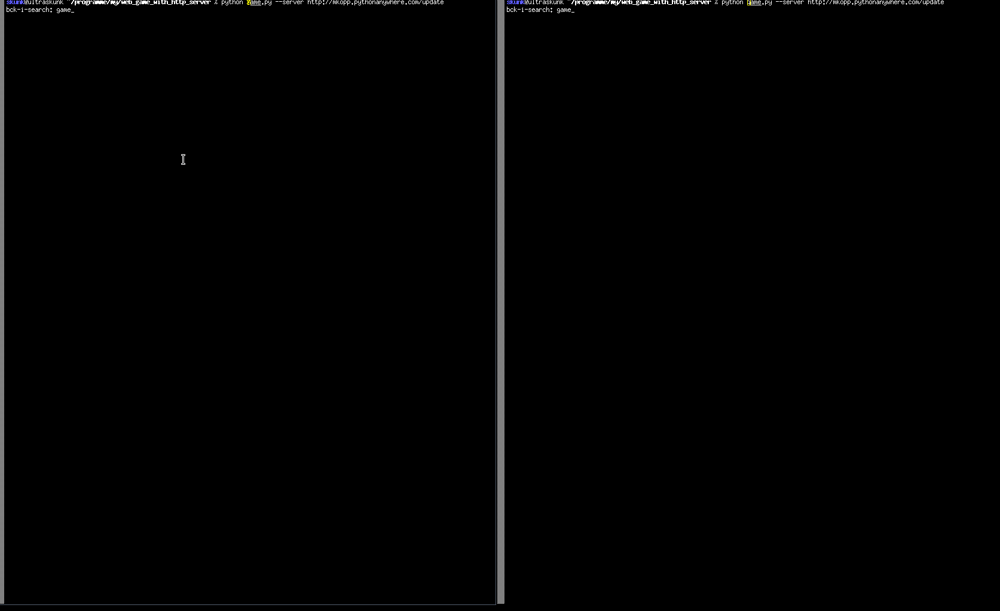

# HTTP Synchronized Arcade Game

This is a demonstration for a very basic and very laggy "multi player mode"
using a central flask server and communication via json objects with it.

# Run the Demo

To run the demo, first install all necessary tools, e.g. via

    pip install -r requirements.txt

and then first start a server

    python server.py

and then as much game instances as you like

    python game.py
    python game.py

# Deploy it to PythonAnywhere.com

You can host the `server.py` script on `pythonanywhere.com`.
After doing that, you can use the game with

    python game.py --server http://mkopp.pythonanywhere.com/update

where for `mkopp` you should use your username.

# Clear/inspect data

In `server.py` you can find URLs to use to either display the stored data or
clear it.
Clear the data before starting a new game session, otherwise you will receive a
bunch of "ghosts" in the game from previous games.

# Acknowledgements

The code in `game.py` is based on
[this code](https://github.com/pvcraven/arcade/blob/ad024dd863b51fd605a9b5dbf11e39eb5a202605/arcade/examples/sprite_move_keyboard_better.py)
licensed under
[MIT license](https://tldrlegal.com/license/mit-license)
containing

    Copyright (c) 2020 Paul Vincent Craven
